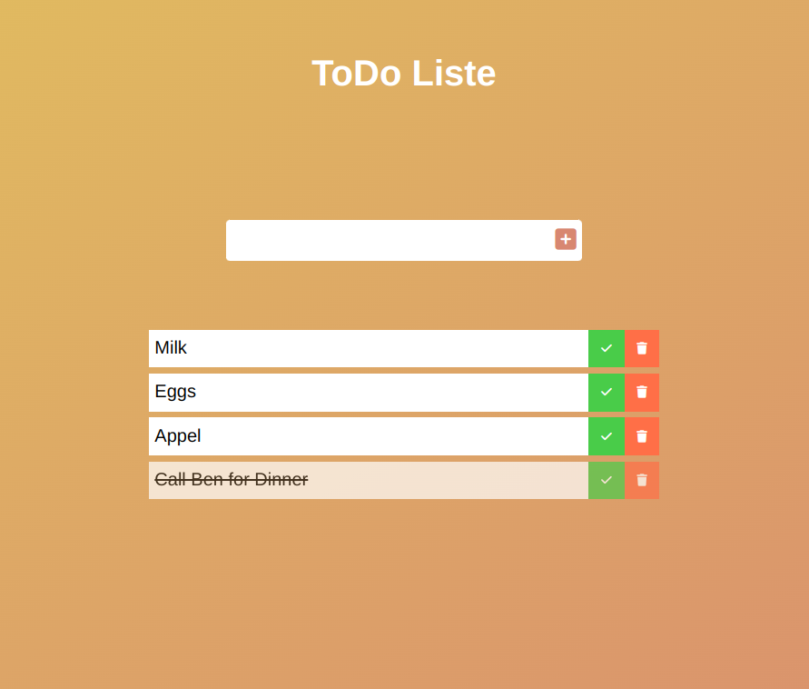

# To-Do-Liste

Dies ist eine einfache Webanwendung für die Verwaltung Ihrer Aufgaben und To-Do-Listen. Mit dieser Anwendung können Sie Ihre Aufgaben organisieren und im Blick behalten.



## Funktionen

- Erstellen Sie Aufgaben und To-Do-Listen.
- Markieren Sie Aufgaben als erledigt.
- Löschen Sie Aufgaben und Listen.
- Benutzerfreundliche Oberfläche für einfache Navigation und Verwaltung.

## Verwendung

1. Besuchen Sie die [Live-Demo](https://todolist-phi-murex.vercel.app/) und beginnen Sie sofort mit der Verwendung der To-Do-Liste.
2. Wenn Sie die Anwendung herunterladen und lokal ausführen möchten, können Sie das Repository klonen und die `index.html`-Datei in einem modernen Webbrowser öffnen:

```bash
git clone https://github.com/Katapluff/todo.git
cd todo-list
```
